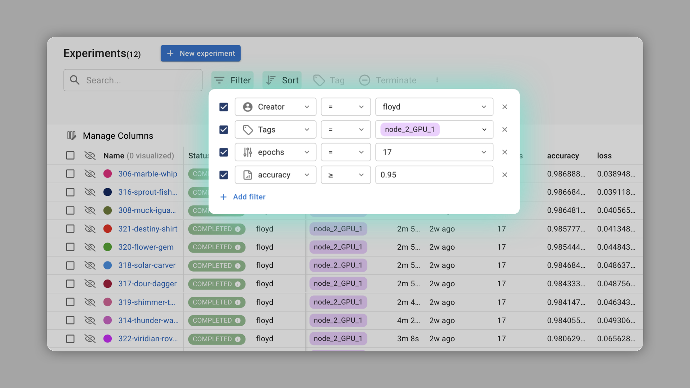

# Release Notes

## December 21, 2021 (v0.11.0)

### Project Overview

VESSL AI gives you a better bird's-eye view of your ongoing project with a **customizable project summary page**. Using Project Overview, you can easily capture an important observation or mark meaningful progress by compiling experiment metrics and visualizations created in VESSL AI.


Project Overview also serves as a **collaborative report for your team** where you can make notes in markdown format – similar to README.md on Git codebase. You can create your own project overview under Project. Refer to our [docs](https://docs.vessl.ai/user-guide/project/project-overview) for more details and a sample document.

.png>)

### Improvements & Fixes

* Improved our Python SDK to support logging .wav files using `vessl.Audio`. Please see the [docs](../api-reference/python-sdk/vessl.log/vessl.audio.md) for more details.
* Optimized the execution of VESSL AI agent querying and logging, bringing noticeable speed improvements across the&#x20;
* Fixed a problem where Docker Image pull would occasionally fail.

## December 1, 2021 (v0.10.0)

### TensorBoard Integration

You can now **record the metrics and media logged to TensorBoard to VESSL**. All you have to do is import our Python SDK and `vessl.init(tensorboard=True)` when you initialize your experiment. Check out our [docs](https://docs.vessl.ai/api-reference/python-sdk/tensorboard) for more details.

```python
import vessl

# Initialize new local experiment with TensorBoard integration
vessl.init(tensorboard=True)
```


### Support for Training Time Estimate

You can now get an **estimate of the remaining training time** by adding `vessl.progress()` to your code. You can view this information by hovering over the status of a running experiment. Refer to our [docs](https://docs.vessl.ai/api-reference/python-sdk/vessl.progress) for common use cases.

```python
# Train function with a training time estimate

def train(model, device, train_loader, optimizer, epoch, start_epoch):
    model.train()
    loss = 0
    for batch_idx, (data, label) in enumerate(train_loader):
        ...

        # Update experiment progress every batch
        vessl.progress(
            ((epoch+1)*batch_size + batch_idx) / (batch_size * epochs))
        )
```

.png>)

## November 1, 2021 (v0.9.0)

### Support for Distributed Experiment

VESSL AI now comes with **PyTorch `DistributedDataParallel`**. You can create multi-node distributed training simply by specifying distributed mode and worker count on the Create New Experiment page. Check out our blog and [docs](https://docs.vessl.ai/user-guide/experiment/distributed-experiment) for more details, including a guide on CLI commands.


### Support for Local Experiment Tracking

With support for **local experiment tracking**, VESSL becomes a more powerful central repository. You can begin recording your local experiments to VESSL by first calling `vessl.init()` and start logging with `vessl.log()`. Refer to our [docs](https://docs.vessl.ai/user-guide/experiment/local-experiment) and [example](https://github.com/savvihub/examples/blob/vssl-2332/vessl-intro.ipynb) for more details.&#x20;

```python
# Initialize new local experiment
vessl.init()
```

```python
# Train function with local experiment tacking

def train(model, device, train_loader, optimizer, epoch, start_epoch):
    model.train()
    loss = 0
    for batch_idx, (data, label) in enumerate(train_loader):
        ...

    # Logging loss metrics to VESSL
    vessl.log(
        step=epoch + start_epoch + 1,
        payload={'loss': loss.item()}
    )
```

### Improved Experiment Dashboard

Experiment dashboard now comes with **tag, filter, and sort options**. You can use these three together to create more specified views like "experiments created by Floyd on `node_2_GPU_1` with accuracy ≥ 0.95 and epoch = 17".



### **Improved Chart Layout and Functions**

You can now **group multiple runs** for a detailed comparison of key metrics, and **configure the range and value of the charts**. With support for synchronized mouseover metrics and pan mode, it's easier to scroll through these charts as well.

.png>)


## Upcoming updates

### August, 2021

* Model Registry
* Improved experiment tracking dashboard
* Quota management

.png>)

.png>)

### More to come in Q4

* Team dashboard with resource usage tracking)
* Fine-grained permission
* Managed Airflow / Airflow integration
* TPU Support
* Fractional GPU
* Dataset versioning - dvc integration
* Dataset, output directory NFS mount
* Save/load files with VESSL SDK

For feature requests, bug reports, and supports, please contact us at contact@vessl.ai.

## July 27, 2021 (v0.6.0)

### Sweep (Hyperparameter Optimization)

You can now find the best hyperparameters using VESSL's automated model tuning. We support grid search, random search, and bayesian optimization. Choose the hyperparameters you want, and let us to optimize it.&#x20;

.png>)

### Minor Fixes

* T4 GPU support
* Attach local volume to workspace

## July 1, 2021 (v0.5.0)

### Workspace

Now you can start your own development environment. **Service** page has been redesigned to **Workspace**. Start your workspace and connect with JupyterLab and SSH.

.png>)


Only files stored in the home directory are persistently managed.


### Minor Fixes

* Dataset versioning is available by dvc integration.

## June 8, 2021 (v0.4.15)

### Support for local datasets

You can now add local dataset. Local dataset can be mounted with NFS protocol in experiment.


Local dataset is only accessible in your cluster. Since VESSL does not have any access to local files, you cannot see your local datasets under dataset page.


.png>)

### Download logs and metrics

You can now download your logs and metrics in experiment detail page.

.png>)

### Minor fixes

* Workspace is renamed to Organization

## May 25, 2021 (v0.4.10)

### CLI-driven project

Now, your source code does not have to be on GitHub to run an experiment on VESSL. Create a CLI-driven project and run `vessl experiment run` on your local terminal without git push.

.png>)

```
$ sv experiment run
[?] Select project: cli-driven-example
   version-control-example
 > cli-driven-example

[?] Experiment message: 
[?] Start command: python main.py
[?] Please choose a cluster: [1] aws-apne2-prod1 (SavviHub)
 > [1] aws-apne2-prod1 (SavviHub)
   [2] on-premise-cluster (Custom)

[?] Please choose a resource: [11] v1.v100-1.mem-52.spot (GPU(V100) x 1 / CPU 8 Cores / Memory 52GB)
   [1] v1.cpu-2.mem-6.spot (CPU 2 Cores / Memory 6GB)
   [2] v1.cpu-2.mem-6 (CPU 2 Cores / Memory 6GB)
   [3] v1.cpu-4.mem-13 (CPU 4 Cores / Memory 13GB)
   [4] v1.k80-1.mem-52 (GPU(K80) x 1 / CPU 4 Cores / Memory 52GB)
   [5] v1.k80-8.mem-480 (GPU(K80) x 8 / CPU 32 Cores / Memory 480GB)
   [6] v1.v100-1.mem-52 (GPU(V100) x 1 / CPU 8 Cores / Memory 52GB)
   [7] v1.v100-4.mem-232 (GPU(V100) x 4 / CPU 32 Cores / Memory 232GB)
   [8] v1.cpu-0.mem-1 (CPU shared / Memory 1GB)
   [9] v1.k80-1.mem-52.spot (GPU(K80) x 1 / CPU 4 Cores / Memory 52GB)
   [10] v1.cpu-4.mem-13.spot (CPU 4 Cores / Memory 13GB)
 > [11] v1.v100-1.mem-52.spot (GPU(V100) x 1 / CPU 8 Cores / Memory 52GB)
   [12] v1.v100-8.mem-480 (GPU(V100) x 8 / CPU 96 Cores / Memory 480GB)
   [13] v1.k80-16.mem-724 (GPU(K80) x 16 / CPU 64 Cores / Memory 724GB)

[?] Please choose a kernel image: [2] savvihub/kernels:py37.full-cpu (Python 3.7 (All Packages))
   [1] savvihub/kernels:py36.full-cpu (Python 3.6 (All Packages))
 > [2] savvihub/kernels:py37.full-cpu (Python 3.7 (All Packages))
   [3] savvihub/kernels:py36.full-cpu.jupyter (Python 3.6 (JupyterLab))
   [4] savvihub/kernels:py37.full-cpu.jupyter (Python 3.7 (JupyterLab))
   [5] tensorflow/tensorflow:1.14.0-py3 (Tensorflow 1.14.0)
   [6] tensorflow/tensorflow:1.15.5-py3 (Tensorflow 1.15.5)
   [7] tensorflow/tensorflow:2.0.4-py3 (Tensorflow 2.0.4)
   [8] tensorflow/tensorflow:2.2.1-py3 (Tensorflow 2.2.1)
   [9] tensorflow/tensorflow:2.3.2 (Tensorflow 2.3.2)
   [10] tensorflow/tensorflow:2.4.1 (Tensorflow 2.4.1)
   [11] tensorflow/tensorflow:2.3.0 (TensorFlow 2.3.0 (Tensorboard))

Upload the zipped local project
Experiment 1 is running. Check the experiment status at below link
https://savvihub.com/example-workspace/cli-driven-example/experiments/1
```

### Service edit & reproduce

**Reproduce** and **Edit** have been added to service actions. A new service with an existing service's configuration by clicking **Reproduce**.

.png>)

You can modify a stopped service's name, computing resource, start command, exposed ports, environment variables and ssh key. Name and ports can be updated even when running.

.png>)

### Minor fixes

* Edit experiment name and message on experiment details
* Pass an experiment message with `-m, --message` options of [_savvihub experiment run_](broken-reference)__
* Add a progress bar during [_savvihub dataset files upload_](broken-reference)__
* Display the experiment message on the output of [_savvihub experiment list_](broken-reference)__

## May 9, 2021 (v0.4.0)

### Billing

You can check your billing information based on on-demand instance usage on Under Settings -> Billing.

.png>)

### Continue training after spot instance termination

If you use spot instance in an experiment, it automatically continues after spot interruption. All you need to do is that make your experiment resist termination, such as save your checkpoint in every epoch, and start your experiment from saved checkpoint. You can check the details in [here](https://docs.savvihub.com/user-guide/commons/spot-instances).

### A100 / V100 spot instance in US West2

You can use A100 spot instances in us west2 (Oregon) region. Select default region as us-west2 in workspace create. You can only select one region per one workspace for now.

.png>)

### Minor Fixes

* Save & load checkpoint in savvihub/examples.
* Fix web terminal link broken in custom cluster.

## Apr 27, 2021 (v0.3.0)

### Support for private docker image

You can use your own private docker registry on DockerHub & AWS ECR. Register your own credentials under Workspace -> Settings -> Integrations.

.png>)

### SSH connection / terminal on web

Now you can connect to your experiment / service with terminal on web, and native SSH connection.

.png>)

### Experiment termination protection

You may want to access the experiment container after it runs. Termination protection allows you to do that. If you checked the checkbox, then the experiment will go to **idle** status upon completion.

.png>)

### Minor Fixes

* (Fix) Log collect on various docker/kubernetes runtime configuration (e.g. RKE)
  * You can configure container log path with`kubernetes.logContainerPath`
  * For RKE, install helm with `--set kubernetes.logContainerPath=/var/log/containers`. ([Ref](https://rancher.com/docs/rancher/v2.x/en/logging/v2.0.x-v2.4.x/project-logging/#logging-scope))
* (Fix) Remove prometheus dependency
  * SavviHub does not install prometheus on savvihub agent installation.
